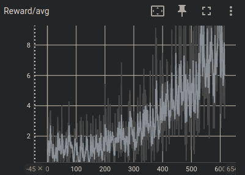
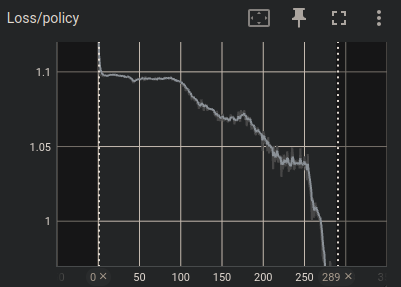
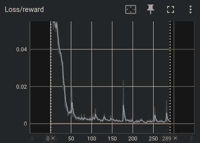
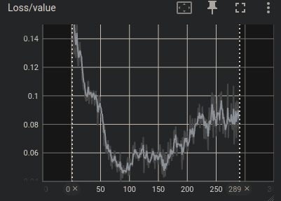

### How to run
```python3 train_torch.py``` 
- For tensorboard visualization: ```tensorboard --samples_per_plugin images=300 --logdir=logs/...```

### Repository structure
- train_torch.py: The RL system responsible for running the environment and recording observations
- src/mcts.py: Monte Carlo Tree Search algorithm for running search in the latent space
- src/networks.py: MuZero agent, containing the Representation Network, Dynamics Network and the Prediction Network
- environment/parallel_breakout: Vectorized custom breakout implementation


### Deviations from MuZero paper
- Removed action mask from the root node of the MCTS search, since this had a tendancy to create a slight bias in the action distribution of the search.
- Added target network for acting stage which copies weights from the trained model (not EMA) every N training iterations. This stabilized training greatly.
- Replay Buffer max size of 65k samples du to memory capacity. 


### Results

Inference test:


<br>
Average reward per acting stage iteration (the max number of steps was capped during training in order to save compute):



<br>
Policy loss:



<br>
Reward loss:



<br>
Value loss:


